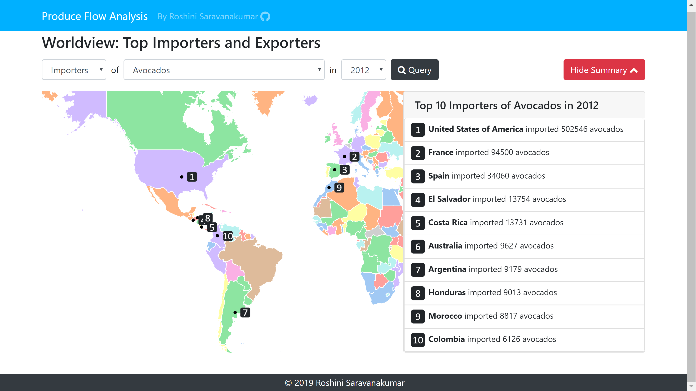
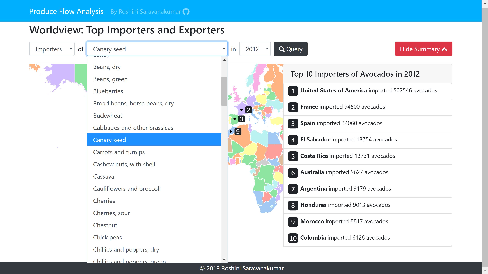
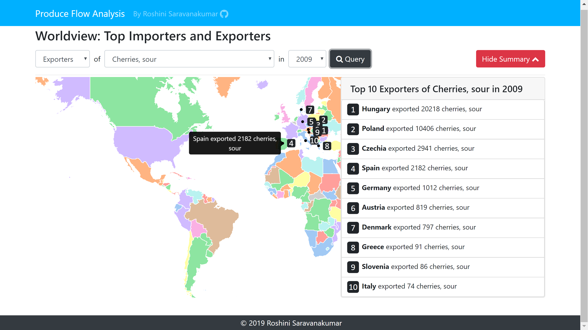
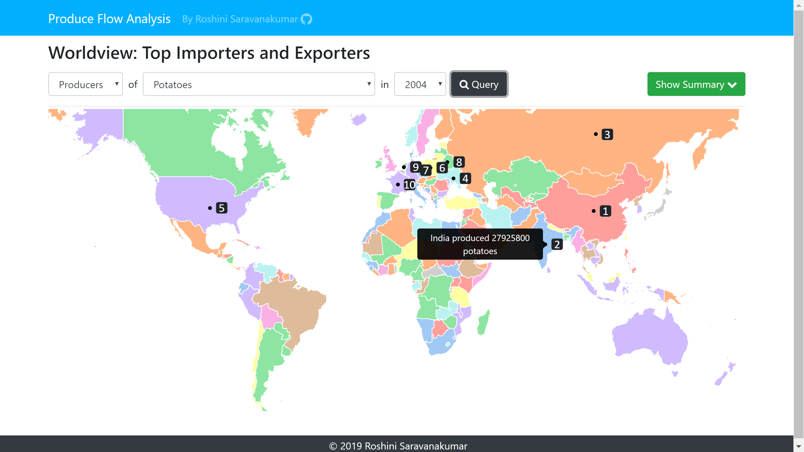

# Produce Flow Analysis

### By Roshini Saravanakumar, in collaboration with Rajesh Mohan

 > Use `npm install` followed by `npm start` within your copy of the directory to view the visualization.

## Part 1: Worldview: Top Importers, Exporters and Producers 🌍
 In my initial visualization, I have created an interface for the user to explore the top 10 producers, exporters and importers for a given crop. The map shown in the pictures below, as well as the summary card, are dynamically updated to fit the data queried by the user.

> This page will be updated as I progress. Come back 🔜 for updates!

## Gallery
### Part 1

## Resources

<a href='https://github.com/datasets/geo-countries/blob/master/data/countries.geojson'>Geo Countries Dataset</a>
- This dataset contains GeoJSON formatted data of the world.
- I removed the multipolygon for Antartica from this dataset since Antartica does not import, export, or produce crops.

<a href='https://community.periscopedata.com/t/63fy7m/country-centroids'>Country Centroids</a>
- This dataset contains entries of each country and its centroid's longitude and latitude, making it very 
useful as a lookup table.
- I modified some of the country names to update formatting so that it would match the produce dataset. 
- I also appended any missing countries which were countries that had split into two new countries in the recent years.